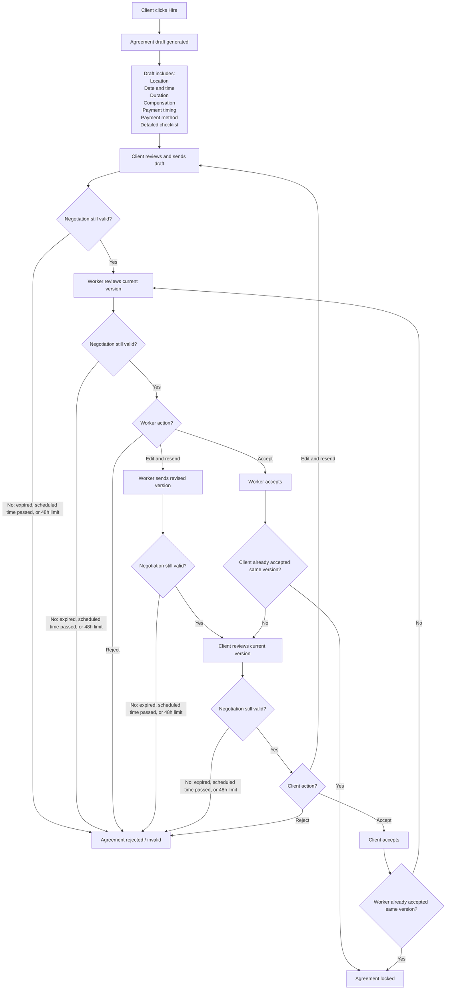

# Agreement negotiation

Versioned back-and-forth after **Hire** produces a draft ([Browse → hire](browse-to-hire.md)), until both parties accept the **same** version or negotiation ends. Continues the narrative in [`giggi.md` §5.D](../../giggi.md#giggi-5-d). **Client** = gig poster in doc/code terms ([`giggi.md` §1.2](../../giggi.md#giggi-1-2)).

**Validity gates:** `TD` runs right after a **client** **send**; `TH` after a worker **send**; `TE` / `TI` before the **other party** chooses accept / edit / reject, so expiry or schedule slip ends negotiation instead of misrouting everyone to worker review.

## Rules (product + implementation)

**Expiry**

- If the gig has a **scheduled start time**, negotiation expires at that time.
- Else if the agreement is **linked to a gig** with an expiration, use **that** gig expiration.
- Else negotiation expires **48 hours after the latest proposal** (timestamp of last sent version).

**Rejection**

- Any **explicit reject** ends negotiation immediately (`X`).

**Versions**

- Every **edit and resend** creates a **new version** (immutable history; do not mutate a version already sent).

**Acceptance**

- **Accept** always means **this exact version** only—never “accept latest” implicitly across edits.

**Integrity (“locked for sender”)**

- Once a version is **sent**, the **sender** cannot **silently change** that sent payload; corrections require a **new version**.

**AI**

- AI **only prepares** drafts and assists copy/structure; it **never** finalizes or locks an agreement without explicit human acceptances on both sides.

**Payment timing & method**

- **Required** on every agreement version the parties review: which **timing** (default pre-fill: after completion) and which **method**; show **exactly** what will be locked. Conditional **contact / number** fields for cash or mobile/bank — see [System rules — Payment timing](../system-rules.md#payment-timing).
