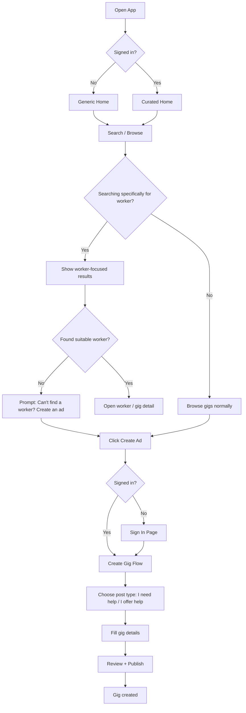

# Browse → create ad (gig)

From app entry through search/browse—including a **worker-specific search** branch with a **create ad** prompt—into the **create gig** flow, gated by sign-in.

```mermaid
flowchart TD
    A[Open App] --> B{Signed in?}

    B -->|No| C1[Generic Home]
    B -->|Yes| C2[Curated Home]

    C1 --> D[Search / Browse]
    C2 --> D

    D --> E{Searching specifically for worker?}

    E -->|No| F[Browse gigs normally]
    E -->|Yes| G[Show worker-focused results]

    G --> H{Found suitable worker?}
    H -->|Yes| I[Open worker / gig detail]
    H -->|No| J[Prompt: Can't find a worker? Create an ad]

    J --> K[Click Create Ad]
    F --> K

    K --> L{Signed in?}
    L -->|No| M[Sign In Page]
    L -->|Yes| N[Create Gig Flow]

    M --> N

    N --> O[Choose post type: I need help / I offer help]
    O --> P[Fill gig details]
    P --> Q[Review + Publish]
    Q --> R[Gig created]
```
