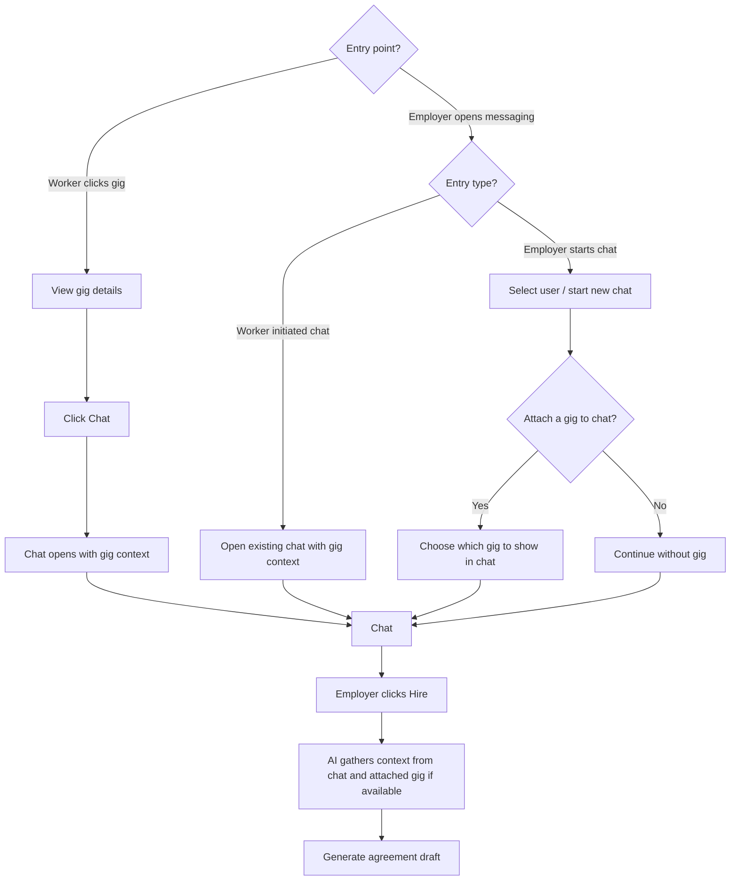

# Browse → hire (worker vs employer entry)

How **chat with gig context** is reached from a **worker** path (gig detail) vs an **employer** path (messaging), then **Hire** → AI context → **agreement draft**. Next: [Agreement negotiation](agreement-negotiation.md). Background trust rules: [`../../giggi.md`](../../giggi.md) §5.D.

