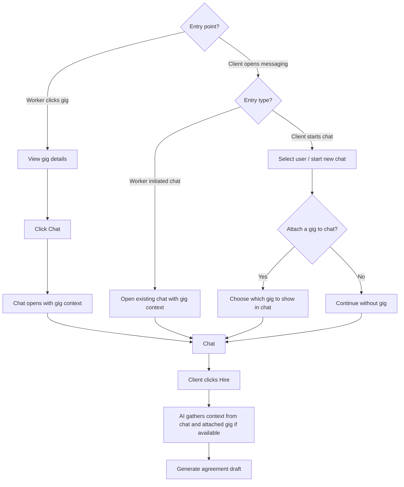

# Browse → hire (worker vs client entry)

How **chat with gig context** is reached from a **worker** path (gig detail) vs a **client** path (messaging — doc term for gig poster), then **Hire** → AI context → **agreement draft**. The same gig may have **several parallel chats** (poster ↔ different workers); each **Hire** creates its own agreement. Workers may be in **many chats across gigs** at once — [System rules — Messaging concurrency](../system-rules.md#messaging-concurrency). Next: [Agreement negotiation](agreement-negotiation.md). Background trust rules: [`../../giggi.md`](../../giggi.md) §5.D. Roles: [`../../giggi.md`](../../giggi.md) §1.2.

