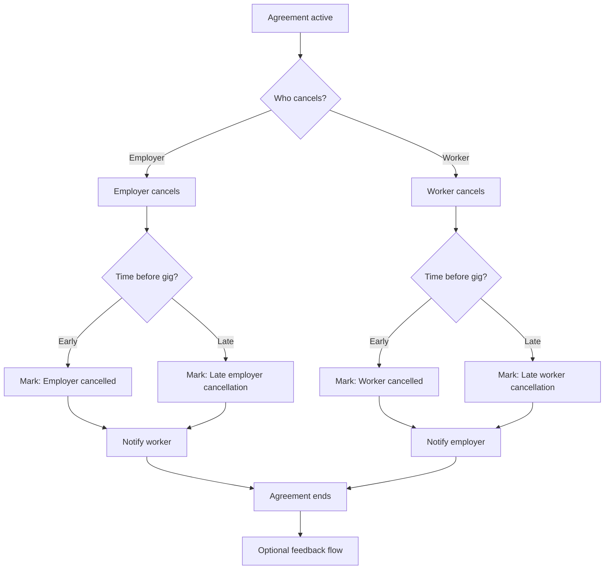

# Cancellation (before gig completion)

Either party may cancel while an **agreement is active** and the gig is **not yet completed**. Preserves **fairness** (notify counterpart, optional feedback) and **trust signals** (who cancelled, early vs late) without MVP hard penalties. Assumes a **locked agreement** from [Agreement negotiation](agreement-negotiation.md).

## Rules

- Cancellation is allowed for **both** parties **any time before completion** (product may still restrict e.g. after work marked done—implementation detail).
- Define **“late”** in config (e.g. **within 12–24h** before agreed start); **late** cancels weigh more heavily on **trust signals** than early ones.
- **MVP:** no hard penalties (fees, bans)—**track behaviour** only; visibility/cooldowns can come later ([`../../giggi.md`](../../giggi.md) §14).
- **Notify** the non-cancelling party **immediately**.
- **Optional feedback** after cancel may still run; align copy and eligibility with [Feedback flow](feedback-flow.md) (e.g. agreement ended without full performance).
- **Cancellation reason** as structured or free text → **Phase B** unless trivial to add.

## System signals (track separately)

- Employer cancellation rate (and counts)
- Worker cancellation rate (and counts)
- **Late** cancellations (by side), distinct from early

These feed reputation / trust **alongside** completion and review signals, not instead of them.

## Contested cancellation

If employer and worker **disagree** on whether a cancel was valid, who initiated it, or material facts, treat as **soft dispute** handling — [System rules — Soft disputes](../system-rules.md#soft-disputes) (record both sides, no blame assignment in MVP).
