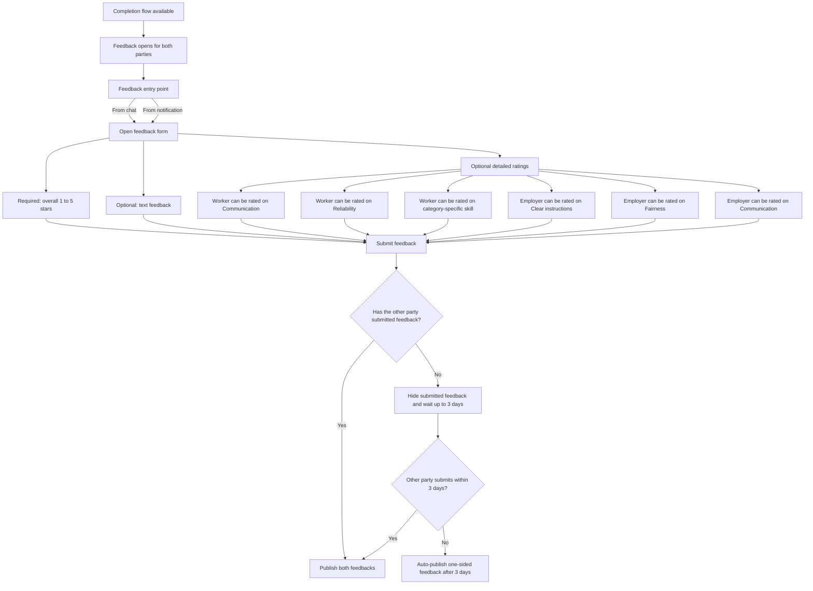

# Feedback (after completion)

Collects **experience** ratings after completion is available (same lifecycle window as completion: from **agreed gig time**). **Completion** answers *what happened*; **feedback** answers *how it was*. Policy detail and metrics: [`../../giggi.md`](../../giggi.md) §5.F.

## Availability

- Feedback becomes available from the **agreed gig time**, but UX should treat it as **paired with completion** (completion flow open / resolved as your product rules define).
- Only **feedback tied to a real agreement** (no orphan or synthetic threads).

## Entry points

- **From chat**
- **From a system notification**

## Fields

| | |
| --- | --- |
| **Required** | Overall **1–5** stars |
| **Optional** | Free-text feedback; **additional dimensions** (keep optional to reduce friction) |

**Recommended optional dimensions**

- **Worker:** Communication · Reliability · **Category-specific skill** (only when relevant), e.g. safe driving (transport), pet care (pet gigs), deep-cleaning quality (cleaning).
- **Employer:** Clear instructions · Fairness · Communication.

**UX**

- Default form **short**; tuck extra dimensions behind **“Add more detail”**.
- **Category-specific** items appear **only** for the gig’s category.

## Reveal and one-sided

- **Both submitted** → **publish both** immediately (`J`).
- **Only one** submitted → keep theirs **hidden** for **up to 3 days** (`K`).
- During wait, show: *“Your feedback will be visible when the other party submits, or in 3 days.”*
- If the other party **never** submits → **auto-publish** the one-sided feedback after **3 days** (`M`).

**Cross-doc:** If you unify all “reveal windows” in one place, reconcile this **3-day** one-sided path with the **7-day** experiment language in [`../../giggi.md`](../../giggi.md) §5.F so engineering and support see one clock.

## Editing and locks

- Allow **editing only until publish** (mutual publish, timeout publish, or one-sided auto-publish).
- After publication → **locked**.

## Completion outcome vs feedback

- **Completion status** and **feedback** are related but **independent**: e.g. *Did not happen* still allows **limited** feedback; **copy must reflect** that no work was completed.
