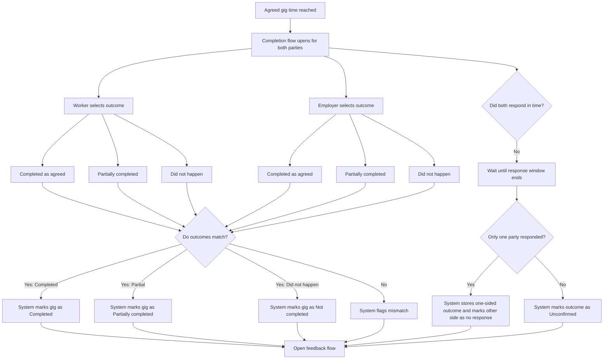

# Gig completion (before feedback)

Two-sided **completion claims** after the **agreed gig end time**, then system resolution (match, mismatch, one-sided, or unconfirmed), then **feedback / review** eligibility — see [Feedback flow](feedback-flow.md). **At gig start**, arrival / no-show handling (grace, signals, then opening completion UI) lives in [No-show flow](no-show-flow.md). Narrative context: [`../../giggi.md`](../../giggi.md) §5.E–F.

**How to read the diagram:** **`C` / `D` → `E`** is the path once **both** parties have submitted and the system **compares** claims. **`B` → `J` → …** is the **response-window** path when the window **ends** without both submissions (implementation: one state machine; timer closes or both-submit triggers the right branch).

## Product notes

- Completion **opens at the agreed gig end time**, not before.
- Parties submit **independently** (same three options each).
- **UI labels** (human wording): *Completed as agreed* · *Partially completed* · *Did not happen*.
- Completion is a **two-sided claim**, not a single source of truth.
- **Both match** → system adopts that tier (`F` / `G` / `H`).
- **Disagree** → **mismatch / disputed** outcome (`I`). MVP **UX and policy** for that situation: [System rules — Soft disputes](../system-rules.md#soft-disputes) (acknowledge, collect input, no manual ruling).
- **Only one** party inside the window → store one-sided outcome; other side **no response** (`M`).
- **Neither** responds → **Unconfirmed** (`N`).

## Trust signals (separate from written reviews)

Track for reputation / trust **even without reviews**:

- Worker no-show  
- Employer no-show  
- Cancellation by worker  
- Cancellation by employer  

Keep these as **structured system signals**, distinct from free-text **reviews** in the feedback flow ([`../../giggi.md`](../../giggi.md) §5.F).
