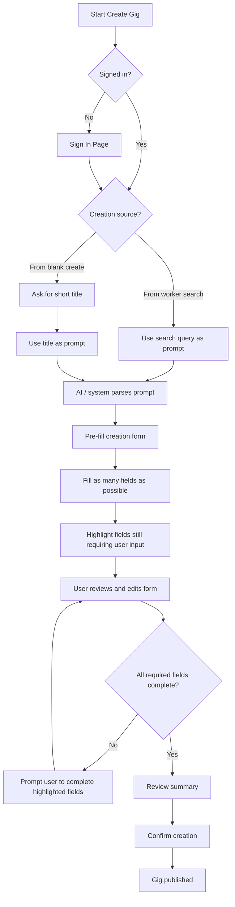

# Gig creation (AI-assisted form)

From **Start Create Gig** through auth, **creation source** (worker search vs blank), prompt assembly, **AI parse → pre-fill**, user completion of required fields, review, and publish. Expands the “Create Gig Flow” step in [Browse → create ad](browse-to-create-ad.md).

## Payment timing & method (on the gig)

- **Optional** on the ad: poster can set **payment timing** preference and **payment method** so discovery surfaces intent early.
- **Defaults:** timing = **after completion**; method unset until user chooses.
- **Methods** that need coordination (cash, mobile pay / bank transfer) should open the **number or identifier** field in the form (see [System rules — Payment timing](../system-rules.md#payment-timing)).
- AI may **suggest** timing from **category** (e.g. cleaning → after completion; longer gigs → flexible); user always overrides.
