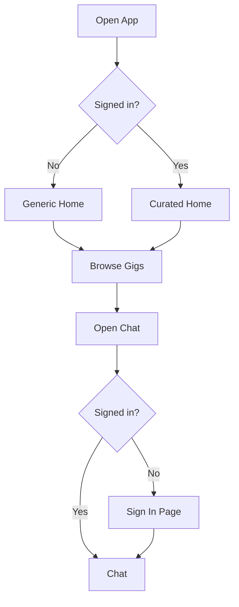

# Home → browse → chat

High-level path from opening the app to entering chat, including **home variant** by auth and **sign-in** when opening chat while signed out.

**Concurrency:** opening **Chat** is not limited to a single gig or thread. Workers may have **many active chats** (different gigs/posters); posters may have **several threads per gig**. See [System rules — Messaging concurrency](../system-rules.md#messaging-concurrency).
