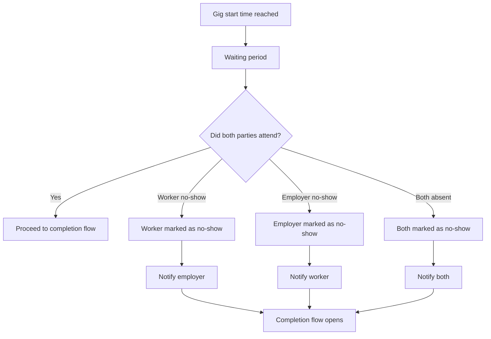

# No-show (at agreed start time)

Handles **one or both parties not attending** at the agreed time, **without automatic detection in MVP**. Uses a **waiting / grace window**, then **user attestation** (and timeouts) that feeds the same **completion** outcomes—especially *Did not happen*—plus **trust signals**. Complements [Gig completion](gig-completion.md) (claims after agreed **end** time) and shared signals in [`../../giggi.md`](../../giggi.md) §5.E.

## Rules (MVP)

- **No automatic detection** (no GPS check-in requirement in MVP). The system uses **user input**, **prompts**, and **timeouts** after the agreed start (and optional grace).
- **Optional grace period** after start (e.g. **30–60 minutes**) before treating non-attendance as actionable; configure explicitly.
- **“No-show”** in product terms is reflected in **completion claims** (e.g. **Did not happen**) and the **structured marks** above—not a separate hidden verdict from the user’s chosen outcome unless product defines a strict mapping table.
- **Waiting period** (`B`) is the grace + “did you meet?” collection window; then branches set **signals** and **notify** the affected party/parties, and **completion flow still opens** (`K`) so both sides can submit claims under [Gig completion](gig-completion.md).

## System signals

Track separately (for trust / reputation, not only star ratings):

- Worker no-show rate (and counts)
- Employer no-show rate (and counts)
- **Both absent** events

## Behaviour (product policy)

- No-show and related signals should affect **trust at least as much as** casual star ratings.
- **Repeated** no-shows (especially worker-side for discovery) may **reduce visibility** in feed—**post-MVP** or behind flags unless already in scope ([`../../giggi.md`](../../giggi.md) §14).

## Conflicting attendance stories

If both sides submit **incompatible** claims about attendance or no-show, use **soft dispute** handling — [System rules — Soft disputes](../system-rules.md#soft-disputes).
